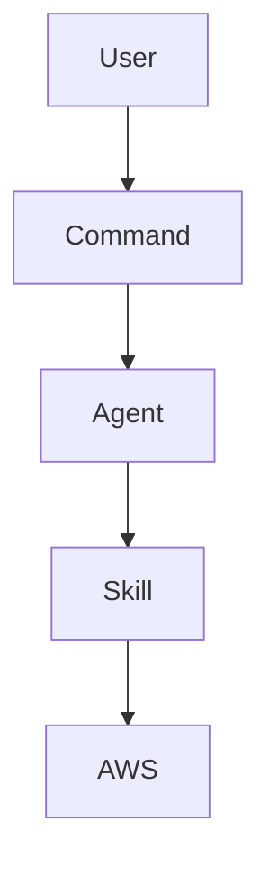

# Documentation Standards

## Purpose

This skill provides documentation standards for all AWS Coworker components. Consistent, clear documentation ensures the framework is understandable, maintainable, and usable by diverse teams.

## When to Use

- Creating new agents, skills, or commands
- Updating existing documentation
- Writing guides and tutorials
- Reviewing documentation quality

## When NOT to Use

- Runtime AWS operations (focus on doing, not documenting)
- Temporary notes (use appropriate channels)

---

## Documentation Principles

### 1. Audience First

Always consider who will read the documentation:

| Audience | Focus | Tone |
|----------|-------|------|
| Platform Engineers | Technical depth, CLI examples | Direct, technical |
| Developers | Quick start, common patterns | Accessible, practical |
| Security/Compliance | Policies, audit trails | Precise, formal |
| New Users | Concepts, getting started | Welcoming, educational |

### 2. Progressive Disclosure

Structure information from simple to complex:

```
1. Overview (what is it?)
2. Quick start (how do I use it?)
3. Details (how does it work?)
4. Advanced (edge cases, customization)
5. Reference (complete specifications)
```

### 3. Show, Don't Just Tell

Include concrete examples:

```markdown
❌ "Configure the profile appropriately"

✅ "Configure the profile in ~/.aws/config:
   ```ini
   [profile dev-admin]
   region = us-east-1
   role_arn = arn:aws:iam::123456789012:role/AdminRole
   ```"
```

### 4. Keep It Current

Outdated documentation is worse than no documentation:

- Update docs when changing code
- Date-stamp time-sensitive content
- Remove obsolete information

---

## Markdown Standards

### Headers

Use ATX-style headers with proper hierarchy:

```markdown
# Document Title (H1 - one per document)

## Major Section (H2)

### Subsection (H3)

#### Minor Point (H4 - use sparingly)
```

### Lists

Use consistent list formatting:

```markdown
Unordered lists:
- Item one
- Item two
  - Nested item
  - Another nested item

Numbered lists:
1. First step
2. Second step
3. Third step
```

### Code Blocks

Always specify language for syntax highlighting:

````markdown
```bash
aws s3 ls
```

```yaml
name: example
version: 1.0.0
```

```json
{
  "key": "value"
}
```
````

### Tables

Use tables for structured comparisons:

```markdown
| Column 1 | Column 2 | Column 3 |
|----------|----------|----------|
| Data | Data | Data |
| Data | Data | Data |
```

### Links

Use descriptive link text:

```markdown
❌ Click [here](url) for more info

✅ See the [Getting Started Guide](docs/getting-started/README.md)
```

---

## Component Documentation

### Agent Documentation

Required sections for agent files:

```markdown
# Agent Name

## Identity
[Who this agent is and its role]

## Purpose
[What this agent does]

## Scope
### In Scope
[What it handles]

### Out of Scope
[What it doesn't handle]

## Allowed Tools
[Table of tools and restrictions]

## Behavior Guidelines
[How the agent should act]

## Collaboration Patterns
[How it works with other agents/skills]

## Example Workflows
[Concrete usage examples]
```

### Skill Documentation

Required sections for SKILL.md:

```markdown
---
[Valid frontmatter]
---

# Skill Name

## Purpose
[Why this skill exists]

## When to Use
[Specific scenarios]

## When NOT to Use
[Anti-patterns]

---

## [Main Content Sections]
[Guidance, patterns, instructions]

---

## Examples
[Concrete examples]

## Related Skills
[Cross-references]
```

### Command Documentation

Required sections for command files:

```markdown
---
[Valid frontmatter]
---

# Command Name

## Overview
[What this command does]

## Prerequisites
[What must be in place]

## Workflow
### Step 1: [Phase Name]
[Instructions]

### Step 2: [Phase Name]
[Instructions]

## Output
[What to expect]

## Error Handling
[Common issues and solutions]
```

---

## Writing Style

### Voice and Tone

- **Active voice**: "The agent validates..." not "Validation is performed by..."
- **Direct**: "Run this command" not "You might want to run this command"
- **Professional but approachable**: Technical without being cold

### Terminology

Use consistent terminology throughout:

| Use | Instead Of |
|-----|------------|
| agent | bot, assistant, AI |
| skill | capability, feature |
| command | workflow, procedure |
| profile | account, credentials |
| mutation | change, modification |

### Abbreviations

Define abbreviations on first use:

```markdown
AWS Coworker uses Infrastructure as Code (IaC) for all production changes.
Subsequent references can use IaC without expansion.
```

Common abbreviations that don't need definition:
- AWS, CLI, API, URL, JSON, YAML

---

## README Standards

### Repository README

Must include:

1. **Title and badges** — Project name, status indicators
2. **Description** — What the project is (1-2 paragraphs)
3. **Quick Start** — Minimal steps to get going
4. **Architecture** — High-level structure (diagram if helpful)
5. **Components** — Overview of major parts
6. **Installation** — Or link to detailed guide
7. **Usage** — Basic examples
8. **Contributing** — Or link to CONTRIBUTING.md
9. **License** — License type and link

### Directory README

For directories with multiple files:

```markdown
# Directory Name

Brief description of what's in this directory.

## Contents

| File | Purpose |
|------|---------|
| file1.md | Description |
| file2.md | Description |

## Usage

How to use the contents of this directory.
```

---

## CHANGELOG Standards

Follow [Keep a Changelog](https://keepachangelog.com/) format:

```markdown
# Changelog

## [Unreleased]

### Added
- New features

### Changed
- Changes to existing features

### Deprecated
- Features to be removed

### Removed
- Removed features

### Fixed
- Bug fixes

### Security
- Security-related changes

## [1.0.0] - YYYY-MM-DD

### Added
- Initial release features
```

---

## Diagrams

### When to Use Diagrams

- Architecture overviews
- Workflow sequences
- Component relationships
- Complex processes

### ASCII Diagrams

For simple diagrams in markdown:

```
┌─────────────┐     ┌─────────────┐
│   Agent     │────▶│    Skill    │
└─────────────┘     └─────────────┘
       │
       ▼
┌─────────────┐
│    AWS      │
└─────────────┘
```

### Mermaid Diagrams

For supported platforms:

````markdown

````

---

## Quality Checklist

Before finalizing documentation:

### Structure
- [ ] Appropriate headers and hierarchy
- [ ] Logical flow from overview to details
- [ ] Consistent formatting

### Content
- [ ] Clear purpose statement
- [ ] Complete coverage of topic
- [ ] Concrete examples included
- [ ] No outdated information

### Style
- [ ] Active voice
- [ ] Consistent terminology
- [ ] Appropriate for audience

### Technical
- [ ] Code examples tested
- [ ] Links verified
- [ ] Frontmatter valid (for skills/commands)

### Accessibility
- [ ] Alt text for images
- [ ] Sufficient contrast (if styling)
- [ ] Screen reader friendly structure

---

## Review Process

### Self-Review

Before submitting:

1. Read through as if seeing it for the first time
2. Check all examples work
3. Verify links are valid
4. Run spell check

### Peer Review

Reviewers should check:

1. Accuracy of technical content
2. Clarity for intended audience
3. Completeness of coverage
4. Consistency with existing docs

---

## Related Skills

- `skill-designer` — For skill documentation structure
- `command-designer` — For command documentation structure
- `git-workflow` — For documentation change management
